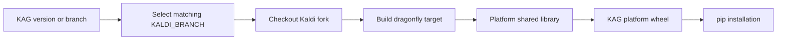

# Building Kaldi Active Grammar

Kaldi Active Grammar (KAG) is built from a duorepo: this repository contains
the Python interface and higher-level logic, while the
[Kaldi Active Grammar fork](https://github.com/daanzu/kaldi-fork-active-grammar)
contains the lower-level C++ code. The Python wheel embeds the native library
built from the matching fork revision.

## Recommended for standard use/installation

Use the binary wheels distributed for all major platforms. This avoids the
repository and dependency downloads, disk space, and CPU time required for a
source build. The wheels are built by automated GitHub Actions CI; see the
[build workflow](.github/workflows/build.yml).

## Local builds

### Linux and macOS

For a normal local Linux or macOS build, for use on the same machine, install
the build requirements and build a wheel. The CMake build downloads and builds
the selected Kaldi fork revision as part of the wheel build:

```sh
python -m pip install -r requirements-build.txt
KALDI_BRANCH=kag-v3.2.0 python setup.py bdist_wheel
```

Replace `kag-v3.2.0` with the matching Kaldi branch. For a development build,
use the current development branch or `origin/master` as appropriate. The
resulting wheel is written to `dist/`.

### Linux: active development with separate checkouts

For work that changes either repository frequently, keep the Python and Kaldi
fork repositories as separate sibling checkouts. Build the fork in place and
use an editable installation of the Python checkout. The staging command below
creates relative symbolic links in the ignored `kaldi_active_grammar/exec/linux`
directory, so the Python process loads the current native build without copying
artifacts between repositories.

```text
workspace/
├── kaldi-active-grammar/        # Python interface and packaging
└── kaldi-fork-active-grammar/   # native engine
```

From the Python checkout, the following commands configure the fork once,
build it, stage its shared library, and install the Python package editable:

```sh
just configure-linux-develop
just build-linux-develop
just setup-linux-develop
KALDIAG_BUILD_SKIP_NATIVE=1 python -m pip install -e .
```

`configure-linux-develop` builds the fork's OpenBLAS dependency, OpenFST, and
configures a CPU-only shared-library build with debug symbols. It downloads
dependencies on its first run. If the fork has already been configured with
the desired options, skip that command.

After editing C++ code, run:

```sh
just build-linux-develop
```

After editing only Python code, no rebuild is needed: the editable install uses
the source checkout. The normal `build-linux`/wheel path is intentionally not
used for this loop because its CMake configuration shallow-clones a separate
fork into `_skbuild`.

The two checkouts remain separate Git repositories; the staging links are
ignored and must not be packaged in a release wheel. Keep their branches or
commits intentionally paired. The C ABI has no runtime version negotiation, so
test both sides together whenever an ABI-facing change is made.

### Linux CI-equivalent build

The Linux CI build uses a Dockcross manylinux container so the resulting wheel
can run on older Linux distributions. Install Docker and `just`, initialize
the checked-in Dockcross helper, and run:

```sh
just setup-dockcross
just build-dockcross manylinux2010_x86_64 kag-v3.2.0 ""
```

The second argument selects the Kaldi fork branch. The optional third argument
is an Intel MKL download URL; leave it empty to use the default non-MKL path.
The helper invokes `building/build-wheel-dockcross.sh`, which builds the wheel
and runs `auditwheel repair`. Repaired wheels are written to `wheelhouse/`.
The CI job may pass `--skip-native` when compatible native binaries have been
restored from its cache; do not use that option unless the matching binaries
are already present in `kaldi_active_grammar/exec/linux`.

See [`CMakeLists.txt`](CMakeLists.txt), [`Justfile`](Justfile), and
[`building/build-wheel-dockcross.sh`](building/build-wheel-dockcross.sh) for
the native and container build details.

### Windows

Windows native builds require Visual Studio 2022 with the v143 toolset, a
Windows 10 SDK, Intel oneMKL, Git, Perl, and a Bash environment such as Git
Bash. The CI job uses `VS_VERSION=vs2022`, `PLATFORM_TOOLSET=v143`,
`WINDOWS_TARGET_PLATFORM_VERSION=10.0`, and `MKL_VERSION=2025.1.0`.

From a parent directory containing the KAG checkout, check out the matching
OpenFST and Kaldi repositories alongside it:

```sh
git clone https://github.com/daanzu/openfst.git openfst
git clone --branch kag-v3.2.0 https://github.com/daanzu/kaldi-fork-active-grammar.git kaldi
```

In `kaldi/windows`, prepare the Visual Studio solution and point it at those
checkouts. The commands below mirror the CI configuration step; run them from
the Kaldi repository:

```sh
cd kaldi/windows
cp kaldiwin_mkl.props kaldiwin.props
cp variables.props.dev variables.props
perl -pi -e 's/<OPENFST>.*<\/OPENFST>/<OPENFST>C:\\path\\to\\openfst<\/OPENFST>/g' variables.props
perl -pi -e 's/<OPENFSTLIB>.*<\/OPENFSTLIB>/<OPENFSTLIB>C:\\path\\to\\openfst\\build_output<\/OPENFSTLIB>/g' variables.props
perl generate_solution.pl --vsver vs2022 --enable-mkl --noportaudio
perl get_version.pl
```

Replace the example paths with the absolute Windows paths to the OpenFST
checkout and its `build_output` directory. The CI also adds
`libfstscript.lib` to the `kaldi-dragonfly` project before building; if the
generated project does not already include it, add it to the project's linker
additional dependencies.

Build OpenFST first, then the Kaldi native target. These commands are run from
a Visual Studio developer prompt (or an environment where `msbuild` is on
`PATH`):

```bat
msbuild -t:Build -p:Configuration=Release -p:Platform=x64 -p:PlatformToolset=v143 -maxCpuCount -verbosity:minimal openfst\openfst.sln
msbuild -t:Build -p:Configuration=Release -p:Platform=x64 -p:PlatformToolset=v143 -p:WindowsTargetPlatformVersion=10.0 -maxCpuCount -verbosity:minimal kaldi\kaldiwin_vs2022_MKL\kaldiwin\kaldi-dragonfly\kaldi-dragonfly.vcxproj
```

Copy the resulting DLL into the Python package, then build the wheel without
rebuilding native code:

```sh
mkdir -p kaldi-active-grammar/kaldi_active_grammar/exec/windows
cp kaldi/kaldiwin_vs2022_MKL/kaldiwin/kaldi-dragonfly/x64/Release/kaldi-dragonfly.dll \
   kaldi-active-grammar/kaldi_active_grammar/exec/windows/
cd kaldi-active-grammar
python -m pip install --upgrade setuptools wheel
env KALDIAG_BUILD_SKIP_NATIVE=1 python setup.py bdist_wheel
```

The Windows wheel is written to `dist/`. Follow the `build-windows` job in the
[CI workflow](.github/workflows/build.yml) if the local Visual Studio layout
differs from these assumptions.

## Build and release coupling

For a non-development KAG version `X`, `setup.py` defaults `KALDI_BRANCH` to
`kag-vX`; development builds default to the fork's `origin/master`. CI repeats
this policy: a tagged Python build selects `kag-<Python tag>`, while an
untagged build selects the corresponding branch name.

On Linux and macOS, KAG's CMake build shallow-clones the selected fork revision,
configures Kaldi with shared libraries and no CUDA, builds the `dragonfly`
target, and copies `libkaldi-dragonfly` into the Python package. Wheel-repair
tooling collects dependent shared libraries where required. Windows CI checks
out both the fork and the Windows OpenFST port, generates the Kaldi Visual
Studio solution, builds `kaldi-dragonfly.dll`, copies it into the package, and
then builds the wheel without rebuilding native code.



This tag/branch convention is the effective native ABI lock. There is no
independent runtime negotiation of ABI version, so mixing an arbitrary Python
checkout with an arbitrary shared library is unsupported even if loading
succeeds.
