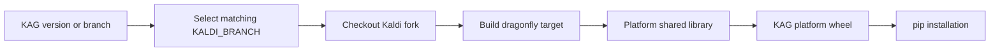

# Building Kaldi Active Grammar

Kaldi Active Grammar (KAG) is built from a duorepo: this repository contains
the Python interface and higher-level logic, while the
[Kaldi Active Grammar fork](https://github.com/daanzu/kaldi-fork-active-grammar)
contains the lower-level C++ code. The Python wheel embeds the native library
built from the matching fork revision.

## Recommended for standard use/installation

Use the binary wheels distributed for all major platforms. This avoids the
repository and dependency downloads, disk space, and CPU time required for a
source build. The wheels are built by automated GitHub Actions CI; see the
[build workflow](.github/workflows/build.yml).

## Local builds

### Linux and macOS

Install the build requirements and build a wheel:

```sh
python -m pip install -r requirements-build.txt
python setup.py bdist_wheel
```

See [`CMakeLists.txt`](CMakeLists.txt) for native build details.

### Windows

Windows builds are less easily automated locally. Follow the steps in the
`build-windows` section of the [build workflow](.github/workflows/build.yml).

## Build and release coupling

For a non-development KAG version `X`, `setup.py` defaults `KALDI_BRANCH` to
`kag-vX`; development builds default to the fork's `origin/master`. CI repeats
this policy: a tagged Python build selects `kag-<Python tag>`, while an
untagged build selects the corresponding branch name.

On Linux and macOS, KAG's CMake build shallow-clones the selected fork revision,
configures Kaldi with shared libraries and no CUDA, builds the `dragonfly`
target, and copies `libkaldi-dragonfly` into the Python package. Wheel-repair
tooling collects dependent shared libraries where required. Windows CI checks
out both the fork and the Windows OpenFST port, generates the Kaldi Visual
Studio solution, builds `kaldi-dragonfly.dll`, copies it into the package, and
then builds the wheel without rebuilding native code.



This tag/branch convention is the effective native ABI lock. There is no
independent runtime negotiation of ABI version, so mixing an arbitrary Python
checkout with an arbitrary shared library is unsupported even if loading
succeeds.
