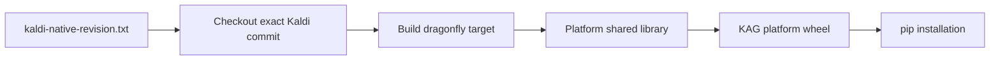

# Building Kaldi Active Grammar

Kaldi Active Grammar (KAG) is built from a duorepo: this repository contains
the Python interface and higher-level logic, while the
[Kaldi Active Grammar fork](https://github.com/daanzu/kaldi-fork-active-grammar)
contains the lower-level C++ code. The Python wheel embeds the native library
built from the exact fork commit recorded in
[`kaldi-native-revision.txt`](kaldi-native-revision.txt). That lock file is the
authoritative Python/native pairing for builds and releases. Reconstructed
pairings for older commits and releases are recorded in the
[historical native revision record](docs/native-revision-history.md).

This project only produces and supports platform-specific wheels. References
to a "source build" in this guide mean building a wheel from a repository
checkout; they do not mean creating or installing a Python source distribution
(`sdist`). Sdists are intentionally unsupported because they do not provide the
project's required, platform-specific native Kaldi library.

## Recommended for standard use/installation

Use the binary wheels distributed for all major platforms. This avoids the
repository and dependency downloads, disk space, and CPU time required for a
source build. The wheels are built by automated GitHub Actions CI; see the
[build workflow](.github/workflows/build.yml).

## Local builds

### Linux and macOS

For a normal local Linux or macOS build, for use on the same machine, install
the build requirements and build a wheel. The CMake build downloads and builds
the selected Kaldi fork revision as part of the wheel build:

```sh
python -m pip install -r requirements-build.txt
python setup.py bdist_wheel
```

The build reads the matching native commit from `kaldi-native-revision.txt`.
For a diagnostic build only, `KALDI_REVISION` may override it with another full
commit hash. The resulting wheel is written to `dist/`.

### Linux: active development with separate checkouts

For work that changes either repository frequently, keep the Python and Kaldi
fork repositories as separate sibling checkouts. Build the fork in place and
use an editable installation of the Python checkout. The staging command below
creates relative symbolic links in the ignored `kaldi_active_grammar/exec/linux`
directory, so the Python process loads the current native build without copying
artifacts between repositories.

```text
workspace/
├── kaldi-active-grammar/        # Python interface and packaging
└── kaldi-fork-active-grammar/   # native engine
```

From the Python checkout, first inspect the sibling checkout. `native-status`
allows active development to differ from the lock; `native-sync` instead checks
out the recorded commit and refuses to discard local changes:

```sh
just native-status
# To reproduce the recorded pair exactly:
just native-sync
just native-verify
```

Then configure the fork once, build it, stage its shared library, and install
the Python package editable:

```sh
just configure-linux-develop
just build-linux-develop
just setup-linux-develop
KALDIAG_BUILD_SKIP_NATIVE=1 python -m pip install -e .
```

`configure-linux-develop` builds the fork's OpenBLAS dependency, OpenFST, and
configures a CPU-only shared-library build with debug symbols. It downloads
dependencies on its first run. If the fork has already been configured with
the desired options, skip that command.

After editing C++ code, run:

```sh
just build-linux-develop
```

After editing only Python code, no rebuild is needed: the editable install uses
the source checkout. The normal `build-linux`/wheel path is intentionally not
used for this loop because its CMake configuration checks out and builds a
separate fork copy in `_skbuild`.

The two checkouts remain separate Git repositories; the staging links are
ignored and must not be packaged in a release wheel. During paired development,
commit the native change first and run `just native-lock` to record its commit
in the Python checkout. The C ABI has no runtime version negotiation, so test
both sides together whenever an ABI-facing change is made.

### Linux CI-equivalent build

The Linux CI build uses a Dockcross manylinux container so the resulting wheel
can run on older Linux distributions. Install Docker and `just`, initialize
the checked-in Dockcross helper, and run:

```sh
just setup-dockcross
just build-dockcross
```

An optional first argument supplies an Intel MKL download URL; omit it to use
the default non-MKL path. The native commit comes from the lock file.
The helper invokes `building/build-wheel-dockcross.sh`, which builds the wheel
and runs `auditwheel repair`. Repaired wheels are written to `wheelhouse/`.
The CI job may pass `--skip-native` when compatible native binaries have been
restored from its cache; do not use that option unless the matching binaries
are already present in `kaldi_active_grammar/exec/linux`.

See [`CMakeLists.txt`](CMakeLists.txt), [`Justfile`](Justfile), and
[`building/build-wheel-dockcross.sh`](building/build-wheel-dockcross.sh) for
the native and container build details.

### Windows

Windows native builds require Visual Studio 2022 with the v143 toolset, a
Windows 10 SDK, Intel oneMKL, Git for Windows (for `cygpath`), and Perl. The
CI job uses `VS_VERSION=vs2022`, `PLATFORM_TOOLSET=v143`,
`WINDOWS_TARGET_PLATFORM_VERSION=10.0`, and `MKL_VERSION=2025.1.0`.

### Windows: active development with separate checkouts

For frequent changes to either repository, keep the Python interface, Kaldi
fork, and Windows OpenFST port in separate sibling checkouts. Run the commands
below from a POSIX-compatible Windows shell, such as Git Bash or Fish (with
`msbuild` and Git for Windows' `cygpath` available on `PATH`), after following
the one-time solution-generation steps in the next section:

```text
C:/src/
|-- kaldi-active-grammar/        # Python interface and packaging
|-- kaldi-fork-active-grammar/   # native engine
`-- openfst/                     # Windows OpenFST port
```

Build OpenFST and `kaldi-dragonfly` with the desired configuration. The
example below uses `Debug`, which is best for native debugging; replace it with
`Release` for performance testing:

```sh
msbuild -t:Build -p:Configuration=Debug -p:Platform=x64 -p:PlatformToolset=v143 -maxCpuCount -verbosity:minimal ../openfst/openfst.sln
msbuild -t:Build -p:Configuration=Debug -p:Platform=x64 -p:PlatformToolset=v143 -p:WindowsTargetPlatformVersion=10.0 -maxCpuCount -verbosity:minimal ../kaldi-fork-active-grammar/kaldiwin_vs2022_MKL/kaldiwin/kaldi-dragonfly/kaldi-dragonfly.vcxproj
```

The recommended staging option is a directory junction. It makes KAG's
ignored `exec/windows` directory point to the fork's MSBuild output, so no DLL
copy step is needed after a rebuild (and the adjacent PDB remains available to
a debugger):

```sh
just setup-windows-develop
env KALDIAG_BUILD_SKIP_NATIVE=1 python -m pip install -e .
```

`setup-windows-develop` creates the junction through `cmd.exe`, so it works
from these shells without enabling Windows Developer Mode or running as an
administrator. It defaults to the sibling fork and the `Debug` output; both
are configurable:

```sh
just setup-windows-develop ../my-kaldi-fork Release
```

If a prior staged `exec/windows` directory or junction exists, remove only
that entry before re-running setup:

```sh
cmd //c rmdir 'kaldi_active_grammar\exec\windows'
```

The alternative `watch-windows-develop` recipe keeps an independent copy in
`exec/windows`. It performs an initial copy, then uses `watchexec` to copy the
DLL after it is created, modified, or renamed by MSBuild:

```sh
just watch-windows-develop
# or: just watch-windows-develop ../my-kaldi-fork Release
```

Use the watcher when a junction is unsuitable. It requires `watchexec` on
`PATH` and does not make PDB files available through the package directory.
Whichever staging option is used, restart the Python process after rebuilding:
Windows cannot replace a DLL that the process has loaded.

### Windows: CI-equivalent native build

From a parent directory containing the KAG checkout, check out the matching
OpenFST and Kaldi repositories alongside it:

```sh
git clone https://github.com/daanzu/openfst.git openfst
git clone https://github.com/daanzu/kaldi-fork-active-grammar.git kaldi
git -C kaldi checkout --detach "$(cat kaldi-active-grammar/kaldi-native-revision.txt)"
```

In `kaldi/windows`, prepare the Visual Studio solution and point it at those
checkouts. The commands below mirror the CI configuration step; run them from
the Kaldi repository:

```sh
cd kaldi/windows
cp kaldiwin_mkl.props kaldiwin.props
cp variables.props.dev variables.props
perl -pi -e 's/<OPENFST>.*<\/OPENFST>/<OPENFST>C:\\path\\to\\openfst<\/OPENFST>/g' variables.props
perl -pi -e 's/<OPENFSTLIB>.*<\/OPENFSTLIB>/<OPENFSTLIB>C:\\path\\to\\openfst\\build_output<\/OPENFSTLIB>/g' variables.props
perl generate_solution.pl --vsver vs2022 --enable-mkl --noportaudio
perl get_version.pl
```

Replace the example paths with the absolute Windows paths to the OpenFST
checkout and its `build_output` directory. The CI also adds
`libfstscript.lib` to the `kaldi-dragonfly` project before building; if the
generated project does not already include it, add it to the project's linker
additional dependencies.

Build OpenFST first, then the Kaldi native target. Run these from a
POSIX-compatible Windows shell where `msbuild` is on `PATH`:

```sh
msbuild -t:Build -p:Configuration=Release -p:Platform=x64 -p:PlatformToolset=v143 -maxCpuCount -verbosity:minimal openfst/openfst.sln
msbuild -t:Build -p:Configuration=Release -p:Platform=x64 -p:PlatformToolset=v143 -p:WindowsTargetPlatformVersion=10.0 -maxCpuCount -verbosity:minimal kaldi/kaldiwin_vs2022_MKL/kaldiwin/kaldi-dragonfly/kaldi-dragonfly.vcxproj
```

Copy the resulting DLL into the Python package, then build the wheel without
rebuilding native code:

```sh
mkdir -p kaldi-active-grammar/kaldi_active_grammar/exec/windows
cp kaldi/kaldiwin_vs2022_MKL/kaldiwin/kaldi-dragonfly/x64/Release/kaldi-dragonfly.dll \
   kaldi-active-grammar/kaldi_active_grammar/exec/windows/
cd kaldi-active-grammar
python -m pip install --upgrade setuptools wheel
env KALDIAG_BUILD_SKIP_NATIVE=1 python setup.py bdist_wheel
```

The Windows wheel is written to `dist/`. Follow the `build-windows` job in the
[CI workflow](.github/workflows/build.yml) if the local Visual Studio layout
differs from these assumptions.

## Build and release coupling

`kaldi-native-revision.txt` contains one full Git commit hash and is the native
ABI lock for every Python commit. CI reads it once, uses it in native cache
keys, and checks out or builds that exact Kaldi revision on every platform.
`KALDI_REVISION` is available as an explicit full-hash override for diagnostic
builds; normal development and release builds should not set it.

On Linux and macOS, KAG's CMake build checks out the locked fork revision,
configures Kaldi with shared libraries and no CUDA, builds the `dragonfly`
target, and copies `libkaldi-dragonfly` into the Python package. Wheel-repair
tooling collects dependent shared libraries where required. Windows CI checks
out both the locked fork commit and the Windows OpenFST port, generates the
Kaldi Visual Studio solution, builds `kaldi-dragonfly.dll`, copies it into the
package, and then builds the wheel without rebuilding native code.


```mermaid
flowchart LR
    Lock[kaldi-native-revision.txt]
    Checkout[Checkout exact Kaldi commit]
    Build[Build dragonfly target]
    Lib[Platform shared library]
    Wheel[KAG platform wheel]
    Install[pip installation]

    Lock --> Checkout --> Build --> Lib --> Wheel --> Install
```

Release tags such as `kag-vX.Y.Z` remain useful names in the native repository,
but they must point at the commit already recorded by the Python release. There
is no independent runtime negotiation of ABI version, so mixing an arbitrary
Python checkout with an arbitrary shared library is unsupported even if loading
succeeds.
