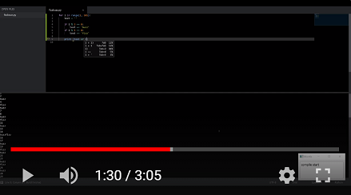

# Kaldi Active Grammar

> **Python Kaldi speech recognition with grammars that can be set active/inactive dynamically at decode-time**

> Python package developed to enable context-based command & control of computer applications, as in the [Dragonfly](https://github.com/dictation-toolbox/dragonfly) speech recognition framework, using the [Kaldi](https://github.com/kaldi-asr/kaldi) automatic speech recognition engine.

<!--  -->

Normally, Kaldi decoding graphs are **monolithic**, require **expensive up-front off-line** compilation, and are **static during decoding**. Kaldi's new grammar framework allows **multiple independent** grammars with nonterminals, to be compiled separately and **stitched together dynamically** at decode-time, but all the grammars are **always active** and capable of being recognized.

This project extends that to allow each grammar/rule to be **independently marked** as active/inactive **dynamically** on a **per-utterance** basis (set at the beginning of each utterance). Dragonfly is then capable of activating **only the appropriate grammars for the current environment**, resulting in increased accuracy due to fewer possible recognitions. Furthermore, the dictation grammar can be **shared** between all the command grammars, which can be **compiled quickly** without needing to include large-vocabulary dictation directly.

See the [Changelog](CHANGELOG.md) for the latest updates.

### Features

* **Binaries:** The Python package **includes all necessary binaries** for decoding on **Windows/Linux/MacOS**. Available on [PyPI](https://pypi.org/project/kaldi-active-grammar/#files).
    * Binaries are generated from my [fork of Kaldi](https://github.com/daanzu/kaldi-fork-active-grammar), which is only intended to be used by kaldi-active-grammar directly, and not as a stand-alone library.
* **Pre-trained model:** A compatible **general English Kaldi nnet3 chain model** is trained on **~3000** hours of open audio. Available under [project releases](https://github.com/daanzu/kaldi-active-grammar/releases).
    * [**Model info and comparison**](docs/models.md)
    * Improved models are under development.
* **Plain dictation:** Do you just want to recognize plain dictation? Seems kind of boring, but okay! There is an [**interface for plain dictation** (see below)](#plain-dictation-interface), using either your specified `HCLG.fst` file, or KaldiAG's included pre-trained dictation model.
* **Dragonfly/Caster:** A compatible [**backend for Dragonfly**](https://github.com/daanzu/dragonfly/tree/kaldi/dragonfly/engines/backend_kaldi) is under development in the `kaldi` branch of my fork, and has been merged as of Dragonfly **v0.15.0**.
    * See its [documentation](https://dragonfly2.readthedocs.io/en/latest/kaldi_engine.html), try out a [demo](https://github.com/dictation-toolbox/dragonfly/blob/master/dragonfly/examples/kaldi_demo.py), or use the [loader](https://github.com/dictation-toolbox/dragonfly/blob/master/dragonfly/examples/kaldi_module_loader_plus.py) to run all normal dragonfly scripts.
    * You can try it out easily on Windows using a **simple no-install package**: see [Getting Started](#getting-started) below.
    * [Caster](https://github.com/dictation-toolbox/Caster) is supported as of KaldiAG **v0.6.0** and Dragonfly **v0.16.1**.
* **Bootstrapped** since v0.2: development of KaldiAG is done entirely using KaldiAG.

### Demo Video

### Donations are appreciated to encourage development.

### Related Repositories

* [daanzu/kaldi-grammar-simple](https://github.com/daanzu/kaldi-grammar-simple)
* [daanzu/speech-training-recorder](https://github.com/daanzu/speech-training-recorder)
* [daanzu/dragonfly_daanzu_tools](https://github.com/daanzu/dragonfly_daanzu_tools)
* [kmdouglass/caster-kaldi](https://github.com/kmdouglass/homelab/tree/master/speech-recognition/toolchains/caster-kaldi): Docker image to run KaldiAG + Dragonfly + Caster inside a container on Linux, using the host's microphone.

## Getting Started

Want to get started **quickly & easily on Windows**?
Available under [project releases](https://github.com/daanzu/kaldi-active-grammar/releases):

* **`kaldi-dragonfly-winpython`**: A self-contained, portable, batteries-included (python & libraries & model) distribution of kaldi-active-grammar + dragonfly2. Just unzip and run!
* **`kaldi-dragonfly-winpython-dev`**: [*more recent development version*] A self-contained, portable, batteries-included (python & libraries & model) distribution of kaldi-active-grammar + dragonfly2. Just unzip and run!
* **`kaldi-caster-winpython-dev`**: [*more recent development version*] A self-contained, portable, batteries-included (python & libraries & model) distribution of kaldi-active-grammar + dragonfly2 + caster. Just unzip and run!

Otherwise...

### Setup

**Requirements**:
* Python 3.6+; *64-bit required!*
* OS: Windows/Linux/MacOS all supported
* Only supports Kaldi left-biphone models, specifically *nnet3 chain* models, with specific modifications
* ~1GB+ disk space for model plus temporary storage and cache, depending on your grammar complexity
* ~1GB+ RAM for model and grammars, depending on your model and grammar complexity

**Installation**:
1. Download compatible generic English Kaldi nnet3 chain model from [project releases](https://github.com/daanzu/kaldi-active-grammar/releases). Unzip the model and pass the directory path to kaldi-active-grammar constructor.
    * Or use your own model. Standard Kaldi models must be converted to be usable. Conversion can be performed automatically, but this hasn't been fully implemented yet.
1. Install Python package, which includes necessary Kaldi binaries:
    * The easy way to use kaldi-active-grammar is as a backend to dragonfly, which makes it easy to define grammars and resultant actions.
        * For this, simply run `pip install 'dragonfly2[kaldi]'` to install all necessary packages. See the [dragonfly documentation for details on installation](https://dragonfly2.readthedocs.io/en/latest/kaldi_engine.html#setup), plus how to define grammars and actions.
    * Alternatively, if you only want to use it directly (via a more low level interface), you can just run `pip install kaldi-active-grammar`
1. To support automatic generation of pronunciations for unknown words (not in the lexicon), you have two choices:
    * Local generation: Install the `g2p_en` package with `pip install 'kaldi-active-grammar[g2p_en]'`
        * The necessary data files are now included in the latest speech models I released with `v3.0.0`.
    * Online/cloud generation: Install the `requests` package with `pip install 'kaldi-active-grammar[online]'` **AND** pass `allow_online_pronunciations=True` to `Compiler.add_word()` or `Model.add_word()`
    * If both are available, the former is preferentially used.

### Troubleshooting

* Errors installing
    * Make sure you're using a 64-bit Python.
    * You should install via `pip install kaldi-active-grammar` (directly or indirectly), *not* `python setup.py install`, in order to get the required binaries.
    * Update your `pip` (to at least `19.0+`) by executing `python -m pip install --upgrade pip`, to support the required python binary wheel package.
* Errors running
    * Windows: `The code execution cannot proceed because VCRUNTIME140.dll was not found.` (or similar)
        * You must install the VC2017+ redistributable from Microsoft: [download page](https://support.microsoft.com/en-us/help/2977003/the-latest-supported-visual-c-downloads), [direct link](https://aka.ms/vs/16/release/vc_redist.x64.exe). (This is usually already installed globally by other programs.)
    * Try deleting the Kaldi model `.tmp` directory, and re-running.
    * Try deleting the Kaldi model directory itself, re-downloading and/or re-extracting it, and re-running. (Note: You may want to make a copy of your `user_lexicon.txt` file before deleting, to put in the new model directory.)
* For reporting issues, try running with `import logging; logging.basicConfig(level=1)` at the top of your main/loader file to enable full debugging logging.

## Example usage
* [**Plain dictation interface**](examples/plain_dictation.py): Set up recognizer for plain dictation; perform decoding on given `wav` file.
* [**Full example**](examples/full_example.py): Set up grammar compiler & decoder; set up a rule; perform decoding on live, real-time audio from microphone.
* [**Backend for Dragonfly**](https://github.com/daanzu/dragonfly/tree/kaldi/dragonfly/engines/backend_kaldi): Many advanced features and complex interactions.

## Documentation

Formal documentation is somewhat lacking currently.

The KaldiAG API is fairly low level, but basically: you define a set of grammar rules, then send in audio data, along with a bit mask of which rules are active at the beginning of each utterance, and receive back the recognized rule and text. The easy way is to go through Dragonfly, which makes it easy to define the rules, contexts, and actions.

### Building

* Recommendation: use the binary wheels distributed for all major platforms.
    * Significant work has gone into allowing you to avoid the many repo/dependency downloads, GBs of disk space, and vCPU-hours needed for building from scratch.
    * They are built in public by automated Continuous Integration run on GitHub Actions: [see manifest](.github/workflows/build.yml).
* Alternatively, to build for use locally:
    * Linux/MacOS:
        1. `python -m pip install -r requirements-build.txt`
        1. `python setup.py bdist_wheel` (see [`CMakeLists.txt`](CMakeLists.txt) for details)
    * Windows:
        * Less easily generally automated
        * You can follow the steps for Continuous Integration run on GitHub Actions: see the `build-windows` section of [the manifest](.github/workflows/build.yml).
* Note: the project (and python wheel) is built from a duorepo (2 separate repos used together):
    1. This repo, containing the external interface and higher-level logic, written in Python.
    1. [My fork of Kaldi](https://github.com/daanzu/kaldi-fork-active-grammar), containing the lower-level code, written in C++.

## Contributing

Issues, suggestions, and feature requests are welcome & encouraged. Pull requests are considered, but project structure is in flux.

Donations are appreciated to encourage development.

## Author

* David Zurow ([@daanzu](https://github.com/daanzu))

## License

This project is licensed under the GNU Affero General Public License v3 (AGPL-3.0-or-later). See the [LICENSE.txt file](LICENSE.txt) for details. If this license is problematic for you, please contact me.

## Acknowledgments

* Based on and including code from [Kaldi ASR](https://github.com/kaldi-asr/kaldi), under the Apache-2.0 license.
* Code from [OpenFST](http://www.openfst.org/) and [OpenFST port for Windows](https://github.com/kkm000/openfst), under the Apache-2.0 license.
* [Intel Math Kernel Library](https://software.intel.com/en-us/mkl), copyright (c) 2018 Intel Corporation, under the [Intel Simplified Software License](https://software.intel.com/en-us/license/intel-simplified-software-license), currently only used for Windows build.
