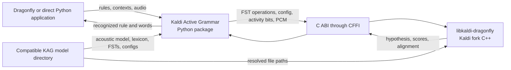
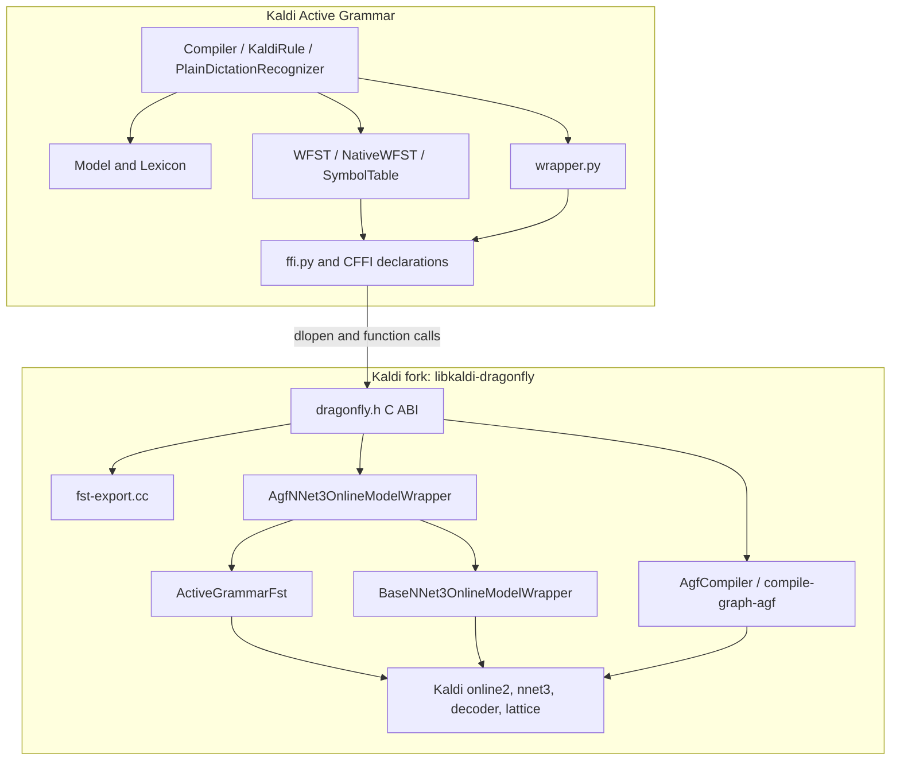
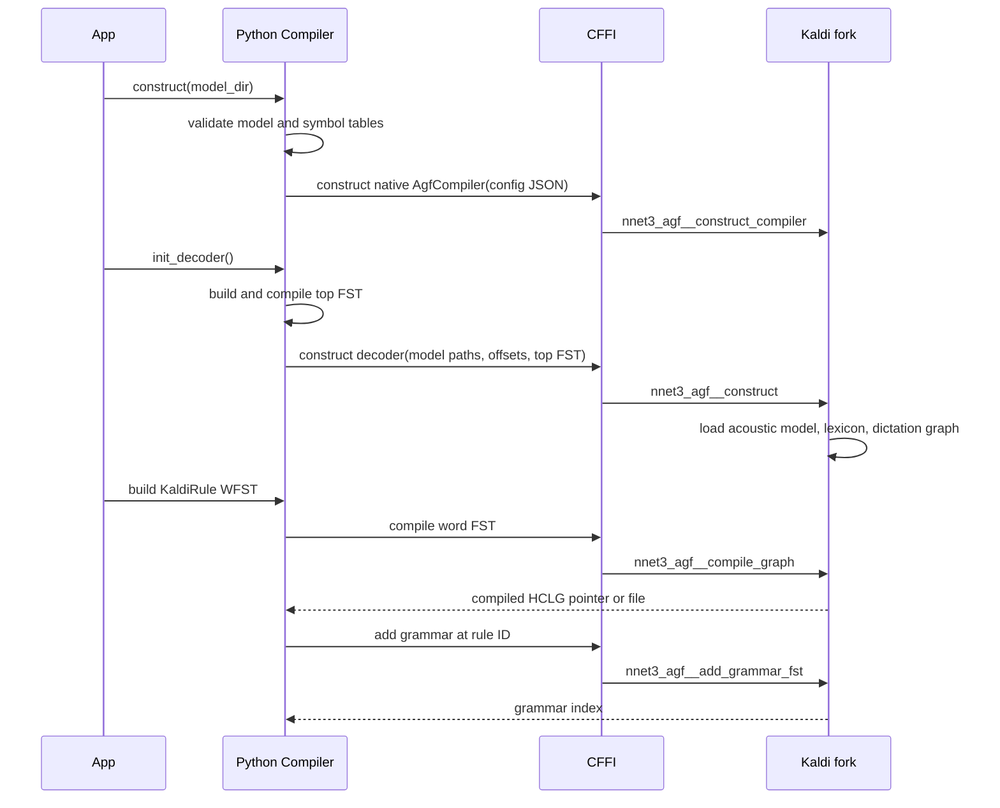
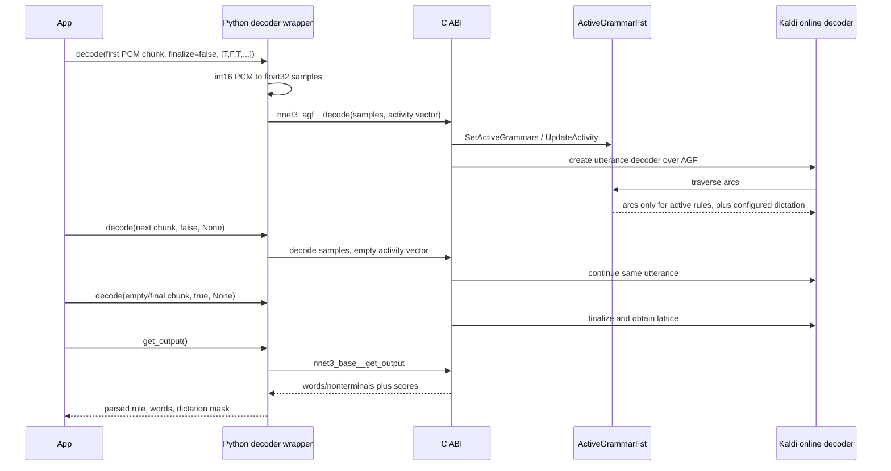

# Kaldi Active Grammar and the Kaldi Fork: Architecture and Interaction

Status: current-state architecture description  
Repositories examined: `kaldi-active-grammar` and `kaldi-fork-active-grammar`  
Reference release: `kaldi-active-grammar` 3.2.0 / `kaldi-fork-active-grammar` tag `kag-v3.2.0`

## 1. Purpose and scope

Kaldi Active Grammar (KAG) is a Python product for grammar-constrained speech recognition. The Kaldi fork is its native C++ engine. The two repositories form a deliberately coupled **duorepo**: they are developed and released separately, but the Python package is built against a matching revision of the fork and distributes the fork's native library inside its wheel.

This document describes:

- why the split exists;
- which repository owns each responsibility;
- how grammars, model data, audio, and recognition results cross the boundary;
- how the active-grammar decoder works internally;
- how the repositories are paired, built, packaged, and tested;
- the invariants and constraints that maintainers must preserve.

The primary path is the default `agf-direct` framework: nnet3 chain decoding with the fork's `ActiveGrammarFst`. The alternative LAF and plain-dictation paths are covered separately.

## 2. Level 0: executive view

The architecture separates **policy and orchestration** from **speech-recognition mechanics**.

| Concern | Owner | Reason |
|---|---|---|
| User/application API | Kaldi Active Grammar | Exposes Python objects suitable for Dragonfly and direct use |
| Grammar/rule lifecycle | Kaldi Active Grammar | Knows rule identity, application context, caching, and active/inactive policy |
| Lexicon and model-file orchestration | Kaldi Active Grammar | Manages words, pronunciations, symbol tables, and compatible model layouts |
| Native ABI adapter | Both | Python declares and calls the C ABI; the fork exports it |
| FST construction and graph compilation primitives | Kaldi fork | Uses OpenFST and Kaldi graph-building algorithms efficiently in C++ |
| Acoustic feature extraction and nnet3 inference | Kaldi fork | Reuses Kaldi's online2/nnet3 implementation |
| Dynamic graph stitching and activity filtering | Kaldi fork | Must operate inside the decoder's FST traversal |
| Lattice, confidence, scoring, and alignment | Kaldi fork | Operates on Kaldi-native decoder and lattice objects |
| Native binary packaging | Kaldi Active Grammar build | Builds the fork and embeds the resulting shared library in the Python wheel |

The fork is therefore not a service and is not a separately installed runtime package. At runtime it is a shared library loaded into the Python process.

## 3. Level 1: repository and deployment architecture

### 3.1 Kaldi Active Grammar repository

The Python repository owns the public product:

- `compiler.py` represents rules as WFSTs, assigns stable rule IDs, compiles them, and loads/reloads/removes them from the decoder.
- `model.py` validates the model directory, maintains symbol tables and pronunciations, and regenerates lexicon-derived artifacts.
- `wfst.py` offers Python and native-backed WFST representations.
- `wrapper.py` provides Python decoder/compiler classes over the C ABI.
- `ffi.py` locates and loads the platform-specific native library with CFFI.
- `plain_dictation.py` supplies the simpler monolithic-dictation API.
- `CMakeLists.txt`, `setup.py`, and CI own native source selection and wheel assembly.

An installed wheel contains Python code plus one of:

- `kaldi_active_grammar/exec/linux/libkaldi-dragonfly.so`;
- `kaldi_active_grammar/exec/macos/libkaldi-dragonfly.dylib`;
- `kaldi_active_grammar/exec/windows/kaldi-dragonfly.dll`.

The wheel is platform-specific but tagged `py3-none` because the boundary is a plain C ABI loaded by CFFI, not a CPython extension ABI.

### 3.2 Kaldi fork repository

The fork contains the full Kaldi source tree plus KAG-specific code in two main layers:

1. `src/dragonfly/` builds `libkaldi-dragonfly` and exports a narrow, C-compatible facade for decoder, compiler, FST, lexicon, and result operations.
2. `src/decoder/active-grammar-fst.*` implements the activity-aware FST traversed by Kaldi's decoder.

The shared library statically or dynamically links the required Kaldi modules, including online2, nnet3, decoder, lattice, feature, HMM, tree, and FST libraries, plus OpenFST and a math library.

The fork README explicitly describes the fork as an implementation for KAG, not a general standalone Kaldi distribution. Much of upstream Kaldi remains unchanged and provides the standard acoustic and graph algorithms; KAG-specific behavior is concentrated in the exported `dragonfly` layer and active-grammar decoder additions.

### 3.3 The model is a third deployment artifact

The wheel does not contain the acoustic model. A compatible model directory supplies, among other files:

- `final.mdl` and `tree`;
- MFCC and i-vector configuration/data;
- `words.txt`, `phones.txt`, and alignment lexicons;
- `L_disambig.fst` and disambiguation symbol lists;
- the dictation graph and optionally a plain `HCLG.fst`;
- KAG nonterminal symbols such as `#nonterm_bos`, `#nonterm:ruleN`, `#nonterm:dictation`, and `#nonterm:end`.

`Model` checks `KAG_VERSION` against `REQUIRED_MODEL_VERSION` when version metadata is present. Compatibility is thus a three-way contract among Python package, native library, and model layout/symbol numbering.

## 4. Level 2: component architecture

### 4.1 Python grammar layer

A `KaldiRule` has an integer `id`, a WFST, compile/load state, and a link to its `Compiler`. IDs are dense and ordered. This is not merely bookkeeping: rule ID `i`, decoder grammar index `i`, activity-vector element `i`, and nonterminal `#nonterm:rulei` must all identify the same rule.

The default `NativeWFST` sends state and arc mutations directly to native OpenFST-backed storage. The older `WFST` representation can serialize text and use a file/pipeline compilation path. Native operation avoids subprocesses and, when caching is disabled, can keep the graph flow entirely in memory.

### 4.2 Native graph compiler

`KaldiAgfCompiler` wraps the fork's `AgfCompiler`. For each rule it takes a word-level grammar FST and performs the normal Kaldi-style graph construction stages, notably:

1. optionally prepend `#nonterm_begin` and append `#nonterm_end` for a subgrammar;
2. compose the grammar with `L_disambig.fst` to form LG;
3. determinize, remove epsilons/disambiguate where configured, minimize, and push;
4. add left-biphone context to form CLG;
5. construct H and compose HCLG;
6. add transition-model self-loops;
7. call `PrepareForActiveGrammarFst` so nonterminal boundaries can be expanded lazily at decode time.

The output is a per-rule, transition-id-to-word decoding graph, not just the word-level rule initially built in Python.

The top graph is compiled separately. It contains alternatives for all rule nonterminals and a return through `#nonterm:end`. A separately compiled dictation subgraph may be shared by every command rule that invokes `#nonterm:dictation`. This avoids copying a large-vocabulary dictation graph into each command graph.

### 4.3 Native online decoder

`AgfNNet3OnlineModelWrapper` owns long-lived model objects and utterance-scoped decoder objects.

Long-lived state includes:

- transition and nnet3 acoustic models;
- feature and decoder configuration;
- symbol/alignment lexicons;
- top, dictation, and per-rule FSTs;
- i-vector adaptation state;
- the reusable `ActiveGrammarFst` wrapper.

Utterance-scoped state includes the online feature pipeline and `SingleUtteranceNnet3DecoderTpl<ActiveGrammarFst>`. These are created at utterance start and cleaned up after finalization.

### 4.4 `ActiveGrammarFst`

`ActiveGrammarFst` is the central fork feature. To the templated Kaldi decoder it looks like one decoding FST, but it lazily stitches together:

- one top FST;
- zero or more rule FSTs paired with rule nonterminal phone IDs;
- an optional dictation FST paired with its nonterminal phone ID.

Its 64-bit state IDs encode both an FST-instance index and a state within that instance. At a prepared nonterminal boundary it expands arcs into the called sub-FST while preserving the left-biphone context needed to enter and return correctly.

Activity is represented by a Boolean vector parallel to the sub-FST list. When a target rule is inactive, the special-state arc iterator reports zero outgoing arcs for that call. The decoder therefore cannot traverse into that grammar. `UpdateActivity` updates cached expanded states selectively rather than rebuilding one monolithic HCLG graph for every context change.

Activity is fixed for an utterance. The first decode call supplies the vector and causes decoder construction; later chunks use the same graph selection. This avoids changing the search space underneath live decoder tokens.

## 5. Runtime interactions

### 5.1 Initialization and rule loading

When an in-memory graph is added, the native decoder creates its own `StdConstFst` copy. This disentangles decoder ownership from the Python-side compiled `StdVectorFst`. Reload likewise installs a new native-owned copy and deletes the previous decoder-owned graph. Removing a rule invalidates the stitched FST and compacts the Python/native index sequence; mutation is forbidden during an utterance.

### 5.2 Streaming an utterance

Audio is expected as mono 16 kHz signed 16-bit PCM at the Python API. The wrapper converts samples to contiguous `float32` before passing a pointer and sample count through the ABI. The native base wrapper performs online feature extraction, i-vector handling, nnet3 inference, pruning, and lattice generation.

Partial results use the current best path. Final results use the finalized lattice and expose likelihood, acoustic and language-model scores, confidence, expected error rate, and optionally word alignment. The emitted symbol sequence includes rule/dictation boundary tokens. Python's `Compiler.parse_output` uses those tokens and the rule-ID map to return the recognized `KaldiRule`, ordinary words, and a per-word dictation mask.

### 5.3 Updating a rule or lexicon

Rule graph changes follow compile then reload. The native wrapper invalidates `ActiveGrammarFst`; on the next utterance it rebuilds the stitched wrapper around the updated graph set. A graph cannot be added, reloaded, or removed while decoding is in progress.

Adding an out-of-vocabulary word is broader. Python updates pronunciation and symbol/lexicon files, regenerates `L_disambig.fst`, reloads the decoder's lexicon, and reconstructs the native compiler so subsequent rule compilations use the new lexicon. Existing dependent compiled graphs are governed by the Python cache/dependency logic.

## 6. The ABI contract

The shared library exports `extern "C"` functions declared in `src/dragonfly/dragonfly.h`. Python repeats the required declarations in `wrapper.py` and `wfst.py`; CFFI parses those declarations and calls the loaded library.

The interface has five groups:

| Group | Representative operations | Data crossing boundary |
|---|---|---|
| Decoder lifecycle | `nnet3_agf__construct`, `__destruct` | model path, JSON config, opaque pointer |
| Grammar lifecycle | `__add_grammar_fst`, `__reload_grammar_fst`, `__remove_grammar_fst` | FST pointer or filename, dense index |
| Recognition | `nnet3_agf__decode`, `nnet3_base__get_output` | float samples, flags, Boolean vector, output buffers/scores |
| Graph compilation | `__construct_compiler`, `__compile_graph*` | JSON config, FST/text/file, result pointer |
| WFST/model utilities | `fst__*`, `utils__build_L_disambig` | states, arcs, labels, filenames, opaque pointers |

Opaque `void*` handles keep C++ types out of Python, and JSON configuration limits ABI churn for decoder/compiler options. The cost is that type safety and lifetime rules are conventional rather than encoded in the C signature. Both sides must change together whenever a signature or ownership rule changes.

Native entry points catch C++ exceptions and return failure sentinels (`false`, `nullptr`, or `-1`) so exceptions do not cross the C boundary. Python converts these into `KaldiError` in most public paths. Native logging remains a separate diagnostic channel controlled through the configured verbosity.

## 7. Build, versioning, and release coupling

See [`BUILDING.md`](../BUILDING.md) for build, versioning, and release-coupling
instructions.

## 8. Alternate decoding paths

### 8.1 LAF

`framework='laf'` keeps word-level rule FSTs and constructs a delayed decode graph using OpenFST `ReplaceFst` and lookahead composition with `HCLr.fst`. At utterance start it includes only active rule FSTs, appends dictation if present, and builds a standard-FST decoder graph. It offers the same high-level activity-vector contract but uses graph replacement/composition rather than `ActiveGrammarFst`'s left-biphone stitching. It is an alternative/experimental implementation, not the default.

### 8.2 Plain dictation

`KaldiPlainNNet3Decoder` loads a conventional monolithic `HCLG.fst` and uses the same native base model, audio, lattice, score, adaptation, and alignment machinery. No per-rule graph list or activity vector is involved. This path demonstrates that the fork also serves as KAG's general native Kaldi wrapper, while dynamic grammar selection is specifically the AGF/LAF responsibility.

## 9. Architectural invariants and constraints

Maintainers should treat the following as hard contracts:

1. **Index identity:** rule ID, rule nonterminal suffix, native grammar index, and activity-vector position must agree.
2. **Dense ordering:** adding returns the next index; removing compacts later IDs on both sides.
3. **Utterance immutability:** grammar activity and graph membership cannot change after an utterance decoder has started.
4. **Vector size:** the supplied activity vector must correspond to all loaded command grammars. Dictation activity is appended internally and is enabled when a dictation graph is configured.
5. **Symbol agreement:** Python WFST labels, model symbol tables, compiler inputs, top graph, and decoder must share exact integer IDs.
6. **Model topology:** AGF graph compilation requires the supported left-biphone setup and KAG nonterminal augmentation.
7. **Object lifetime:** native FST/compiler/decoder handles must be destroyed by the matching exported destructor; decoder-owned FST copies must outlive utterance decoders.
8. **Threading:** a single `ActiveGrammarFst` is not thread-safe. Compilation also contains explicit thread-safety cautions; Python serializes critical preparation with a class lock, then parallelizes rule completion around it.
9. **ABI pairing:** Python declarations and native exports must be released as a matched set.
10. **No mid-decode reload:** native code rejects invalidating a grammar graph while decoder tokens are live.

## 10. Performance characteristics

The design moves expense to the most reusable level:

- the acoustic model and feature configuration load once per decoder;
- the dictation graph is compiled and stored once;
- each command rule is compiled independently and may be cached by content/dependency hash;
- the active graph is stitched lazily;
- changing application context sends a compact Boolean vector instead of recompiling a monolithic graph;
- native FSTs avoid text serialization and subprocess overhead;
- utterance decoders are recreated so activity can change safely between utterances while adaptation state may persist.

Accuracy improves because inactive commands are absent from the decoder search space, not merely rejected after recognition. This reduces competing hypotheses during beam search.

The main costs are native model memory, all loaded rule graphs, the shared dictation graph, lazy expanded-state caches, and per-utterance feature/decoder/lattice state. Very large rule sets also increase activity-vector and top-graph size, although inactive subgraphs are not traversable.

## 11. Failure boundaries and diagnostics

Typical integration failures fall into recognizable layers:

| Symptom | Likely boundary |
|---|---|
| Shared library cannot be loaded or symbol is missing | wheel/native build mismatch or missing dependent library |
| Constructor fails while reading files | incompatible/incomplete model directory or bad JSON-resolved path |
| Missing `#nonterm_*` symbol | model was not converted/augmented for KAG |
| Rule index assertion | Python/native grammar lifecycle ordering diverged |
| Activity length error or unexpected active rule | caller did not supply one Boolean per loaded rule at utterance start |
| Graph compilation failure | empty/nondeterminizable grammar, lexicon mismatch, or unsupported topology |
| Reload rejected | attempted graph mutation during an utterance |
| Output parses to no rule | no active grammar matched, acoustic decode failed to reach a command path, or boundary tokens are inconsistent |

Python logs cover grammar lifecycle, configuration, cache decisions, and timing. The native library covers graph construction, decoder/lattice behavior, and Kaldi errors. Debugging cross-boundary failures usually requires enabling both.

## 12. Change-impact guide

Use the repository boundary to decide where a change belongs:

- Change rule semantics, application-facing configuration, caching, pronunciation behavior, or output parsing in KAG.
- Change acoustic decoding, FST traversal, graph compilation algorithms, lattice metrics, or native performance in the fork.
- Change both repositories for any C ABI addition or alteration.
- Change the model format and KAG together when adding symbol-table or graph prerequisites; bump/check model compatibility as appropriate.
- Add an exported C operation in `dragonfly.h`, implement it under `src/dragonfly`, mirror its declaration and error handling in the Python wrapper, then exercise it through package-level tests.
- Publish matching tags before producing a release wheel.

## 13. Source map

The most important implementation references are:

- KAG build and source selection: [`CMakeLists.txt`](../CMakeLists.txt), [`setup.py`](../setup.py), [`.github/workflows/build.yml`](../.github/workflows/build.yml)
- Python/native loading boundary: [`kaldi_active_grammar/ffi.py`](../kaldi_active_grammar/ffi.py)
- ABI declarations and Python decoder/compiler wrappers: [`kaldi_active_grammar/wrapper.py`](../kaldi_active_grammar/wrapper.py)
- Rule compilation, loading, activity, and output parsing: [`kaldi_active_grammar/compiler.py`](../kaldi_active_grammar/compiler.py)
- Native-backed FST facade: [`kaldi_active_grammar/wfst.py`](../kaldi_active_grammar/wfst.py)
- Model and lexicon contract: [`kaldi_active_grammar/model.py`](../kaldi_active_grammar/model.py)
- Native ABI: fork [`src/dragonfly/dragonfly.h`](https://github.com/daanzu/kaldi-fork-active-grammar/blob/kag-v3.2.0/src/dragonfly/dragonfly.h)
- Native online decoder: fork [`src/dragonfly/base-nnet3.h`](https://github.com/daanzu/kaldi-fork-active-grammar/blob/kag-v3.2.0/src/dragonfly/base-nnet3.h) and [`agf-sub-nnet3.cc`](https://github.com/daanzu/kaldi-fork-active-grammar/blob/kag-v3.2.0/src/dragonfly/agf-sub-nnet3.cc)
- Native graph compiler: fork [`src/dragonfly/compile-graph-agf.hh`](https://github.com/daanzu/kaldi-fork-active-grammar/blob/kag-v3.2.0/src/dragonfly/compile-graph-agf.hh)
- Native FST facade: fork [`src/dragonfly/fst-export.cc`](https://github.com/daanzu/kaldi-fork-active-grammar/blob/kag-v3.2.0/src/dragonfly/fst-export.cc)
- Dynamic active graph: fork [`src/decoder/active-grammar-fst.h`](https://github.com/daanzu/kaldi-fork-active-grammar/blob/kag-v3.2.0/src/decoder/active-grammar-fst.h) and [`active-grammar-fst.cc`](https://github.com/daanzu/kaldi-fork-active-grammar/blob/kag-v3.2.0/src/decoder/active-grammar-fst.cc)
- Alternative LAF graph: fork [`src/dragonfly/laf-sub-nnet3.cc`](https://github.com/daanzu/kaldi-fork-active-grammar/blob/kag-v3.2.0/src/dragonfly/laf-sub-nnet3.cc)
- Runtime examples and behavioral tests: [`examples/full_example.py`](../examples/full_example.py), [`tests/test_grammar.py`](../tests/test_grammar.py), and [`tests/test_plain_dictation.py`](../tests/test_plain_dictation.py)

## 14. Summary

Kaldi Active Grammar is the product and policy layer; the Kaldi fork is the embedded execution engine. Python defines and manages independent rules, compiles them through the fork, maps application context to an ordered activity vector, streams audio, and interprets tokenized output. The fork turns those rules into Kaldi decoding graphs, filters nonterminal traversal inside `ActiveGrammarFst`, performs online nnet3 decoding, and returns lattice-derived results through a stable C facade.

Their separation allows the public API and context-management logic to remain Pythonic while keeping graph compilation and decoding close to Kaldi and OpenFST. Their release, ABI, symbol tables, model format, and rule indexing remain tightly coupled by design.
